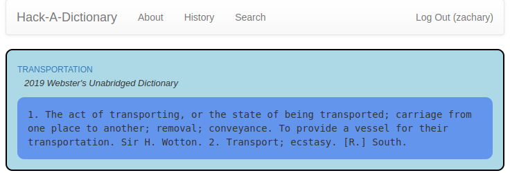

Hack-A-Day is a project I'm doing in November, where I try to make 30 new projects, in 30 days.

# Day 08: Hack-A-Dictionary

This is a dictionary search tool. If you're logged in, it will save your searches.

Demo available at [here](https://tilde.za3k.com/hackaday/dictionary).

Source available on [github](https://github.com/za3k/day08_dictionary).

## Credits

The dictionary used is the 2009 Edition of Webster's Unabridged English Dictionary, provided by [Project Gutenberg](https://www.gutenberg.org/ebooks/661). It was converted into JSON and cleaned up by [matthew reagan](https://github.com/matthewreagan/WebstersEnglishDictionary).
